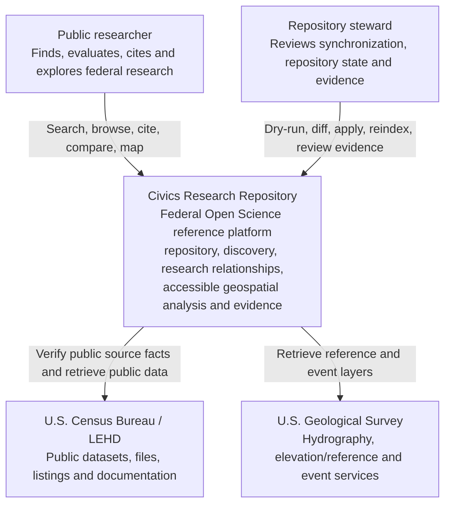
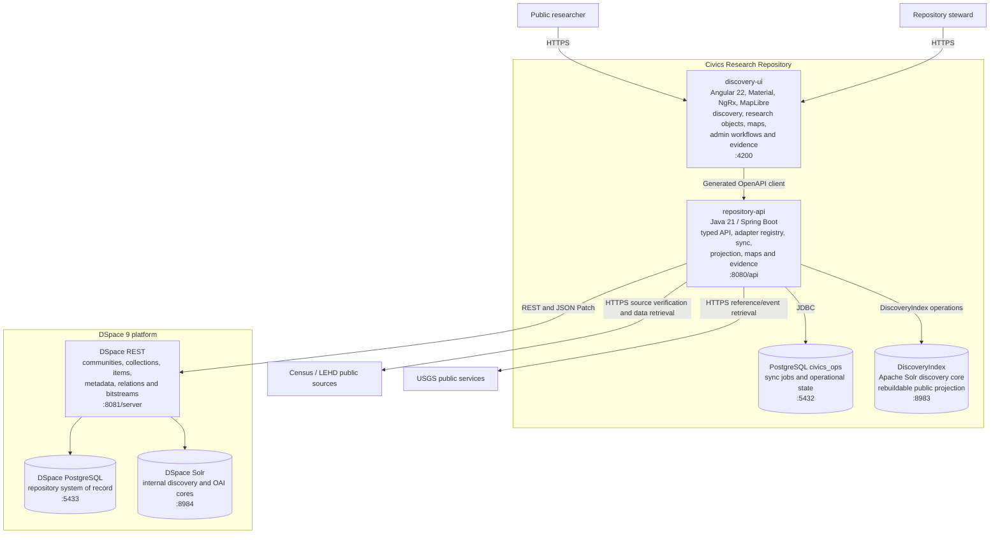
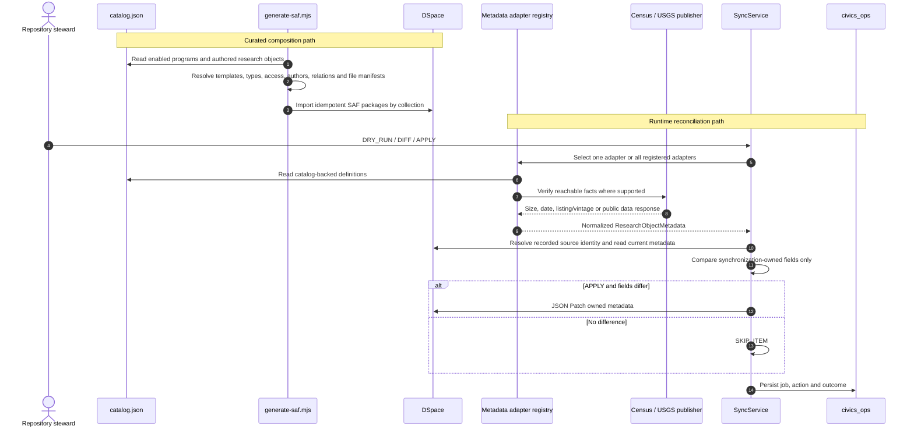
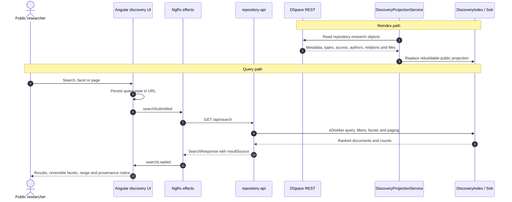
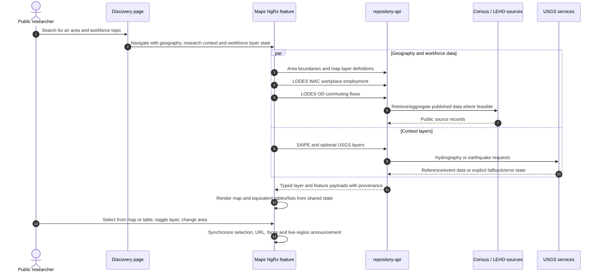
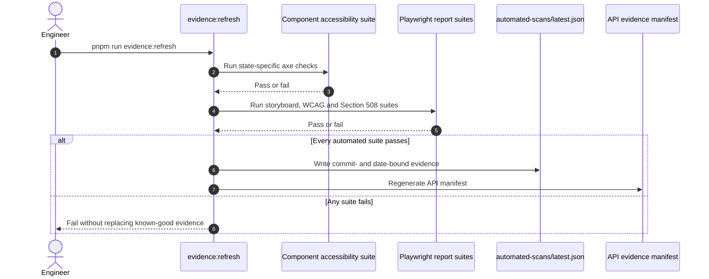

# Architecture Diagrams

These diagrams describe the current implementation. Planned work is not drawn as if it exists; open seams are listed at the end. Volatile counts are generated in [platform-status.md](platform-status.md).

## C4 Level 1 — System context

The local demo is unauthenticated. Before deployment, steward actions require an authorization boundary; public discovery remains anonymous.

## C4 Level 2 — Containers

## Repository composition and reconciliation

The two paths are complementary. Publisher facts can be discovered; repository composition and typed research-package relationships remain curated.

## Search and faceted discovery

If the repository path is unavailable, fixture content may be used only with `resultSource: FIXTURE` and a visible notice.

## Discovery to workforce map

## Accessibility evidence refresh

Manual keyboard, NVDA, JAWS, map-equivalence and cognitive records remain outside this automated sequence.

## Current seams

- The catalog is curated; publisher listing and vintage checks support it but do not automatically redefine repository composition.
- Bitstream mirroring is bounded by budget rather than complete.
- Curated research-package objects intentionally do not pretend to have publisher-derived adapter identities.
- Manual assistive-technology and trusted map-click evidence is not yet recorded.
- The full browser-evidence matrix is not yet a required CI check.
- AWS architecture is documented but not expressed as Terraform/CDK.
- Some route names and residual UI copy remain dataset-shaped while the domain model is research-object-shaped.
