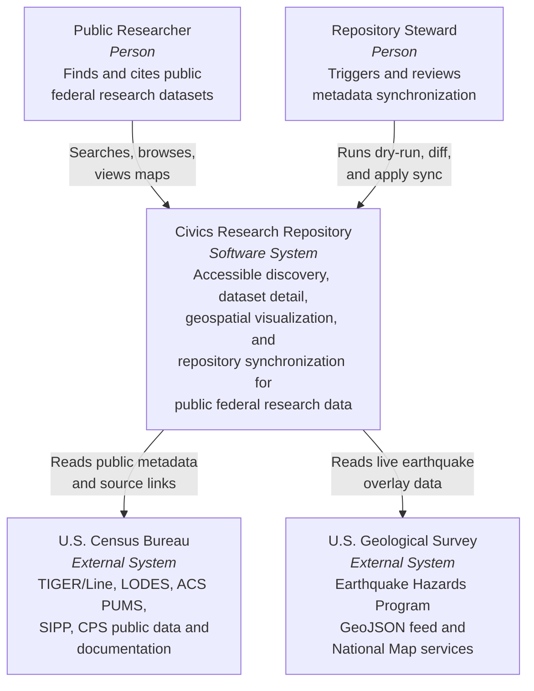
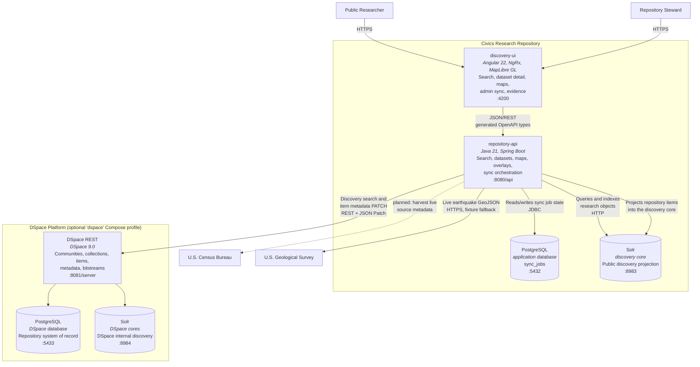
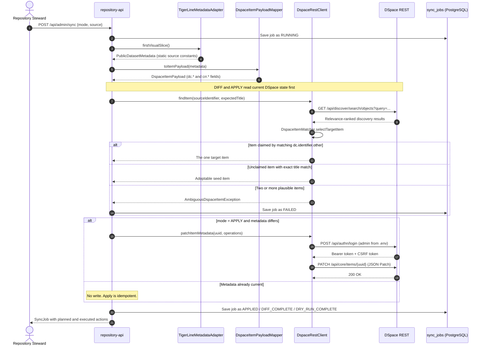
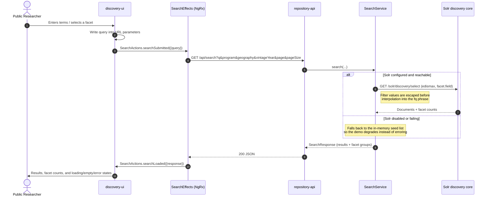
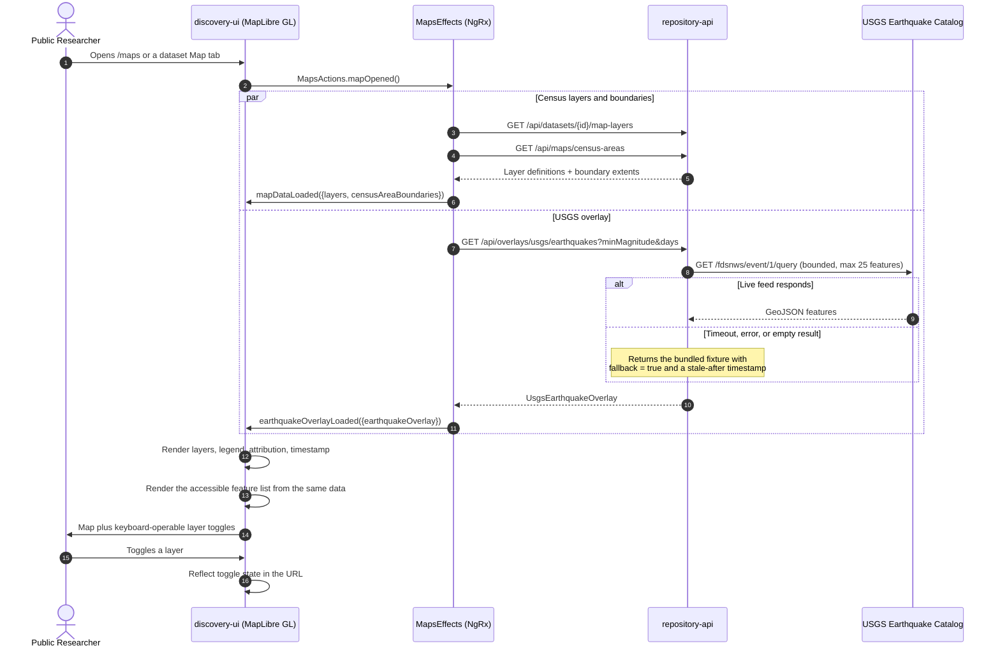

# Architecture Diagrams

C4 context and container views plus the three sequences that carry the demo: public dataset ingestion, search and faceted discovery, and dataset map rendering.

These diagrams describe **what runs today**, not the target state. Where the implementation is still fixture-backed, the diagram says so rather than drawing the intended arrow. Planned-but-absent paths are drawn as dashed lines and labelled `planned`. See [Known Seams](#known-seams) for the list and [planning/TODO.md](../planning/TODO.md) for the work that closes them.

## C4 Level 1 - System Context

The system is unauthenticated in the local demo. Both people are roles rather than accounts; see [planning/DECISIONS.md](../planning/DECISIONS.md) under "Admin API Authentication" for what changes before deployment.

## C4 Level 2 - Containers

### Why two PostgreSQL instances and two Solr instances

This is the most common question the diagram raises, and the current naming does not answer it well. The four datastores serve two different jobs:

| Container                                        | Role                                                                | Owner            |
| ------------------------------------------------ | ------------------------------------------------------------------- | ---------------- |
| Application PostgreSQL (`postgres`, :5432)       | Application operational state — currently only `sync_jobs`          | `repository-api` |
| DSpace PostgreSQL (`dspace-postgres`, :5433)     | Repository system of record — items, metadata, bitstreams, workflow | DSpace           |
| Discovery Solr (`solr`, core `discovery`, :8983) | Public discovery projection queried by the API                      | `repository-api` |
| DSpace Solr (`dspace-solr`, :8984)               | DSpace's own internal search and OAI cores                          | DSpace           |

Both PostgreSQL databases are currently named `dspace`, which makes the split harder to read than it needs to be. Renaming the application database to `civics_ops` is an accepted decision that has not yet been applied — see [planning/DECISIONS.md](../planning/DECISIONS.md) under "Datastore Roles and Naming".

## Sequence - Public Dataset Ingestion

`pnpm run sync:apply`, or `POST /api/admin/sync` with `mode: APPLY`. Dry-run and diff share this path and stop before the write.

Two properties this sequence is designed to guarantee:

- **It never guesses which item to write to.** Discovery is relevance-ranked, so an unqualified first result is not a safe write target. Ambiguity fails the job.
- **A second identical apply performs no write.** Metadata is compared as unordered value/language pairs, because DSpace orders repeated values by `place` and that order need not match adapter order.

Not yet implemented: bitstream and file-manifest reconciliation. `sync:diff` therefore still reports `UPDATE_ITEM` rather than `SKIP_ITEM` for the seeded item.

## Sequence - Search and Faceted Discovery

The `discovery` core is populated by `DiscoveryProjectionService` from DSpace items, so both the Solr path and the in-memory path serve repository content. When the repository returns nothing — DSpace down, unseeded, or genuinely empty — the fixture catalog is indexed instead and every response carries `resultSource: FIXTURE`, which the UI displays as a placeholder-data notice. Rebuild the projection at any time with `pnpm run reindex`.

## Sequence - Dataset Map Rendering with USGS Overlay

The two effects are deliberately independent: a USGS outage degrades the overlay to an error or stale state while the Census layers stay usable. Accessibility requirements carried by this sequence — the feature list rendered from the same data as the map, the non-color-only legend, visible attribution and update timestamp, and keyboard-operable toggles — are specified in [mapping-visualization.md](mapping-visualization.md) and verified in the storyboard and WCAG suites.

## Known Seams

Places where the implementation is narrower than the architecture. Each is tracked in [planning/TODO.md](../planning/TODO.md).

1. **Source metadata is static.** `TigerLineMetadataAdapter` returns compile-time constants rather than harvesting Census.
2. **Bitstream reconciliation is absent.** Sync reconciles Dublin Core and `crr.*` metadata only, so `sync:diff` reports `UPDATE_ITEM` rather than `SKIP_ITEM`.
3. **Application database naming is ambiguous.** Both PostgreSQL databases are named `dspace`.
4. **`start:all` does not include DSpace.** The DSpace profile must be started separately, so there is no single command that brings up the whole demo.
5. **Only the TIGER/Line North Dakota item is synchronized.** The other five seeded items are imported by the DSpace seed and read back through discovery, but no adapter reconciles them.

Closed: discovery and dataset detail are now served from DSpace. The fixture catalog remains only as a labelled fallback.
