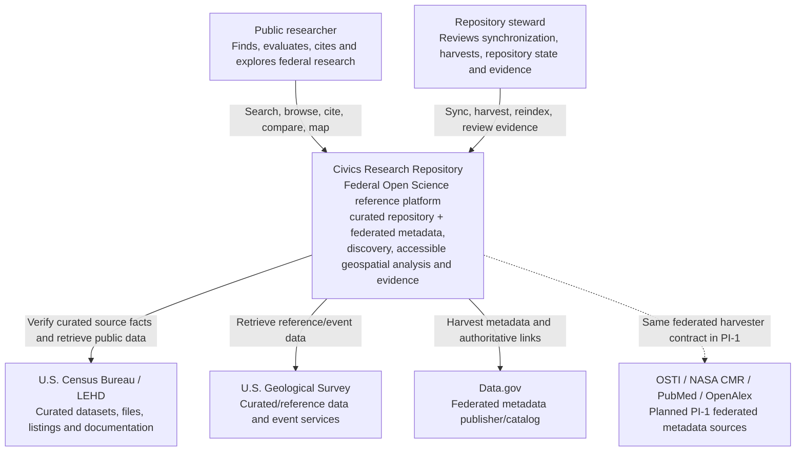
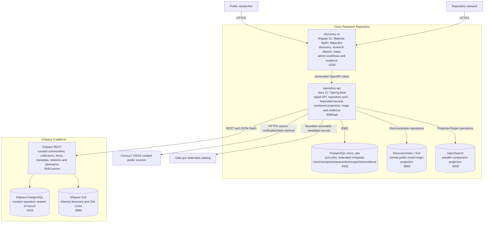
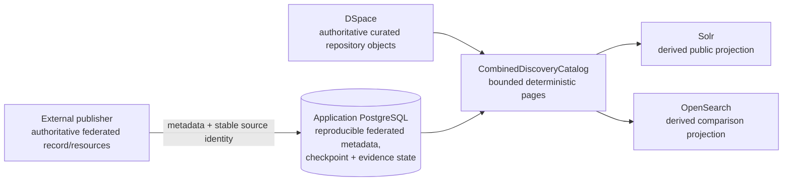
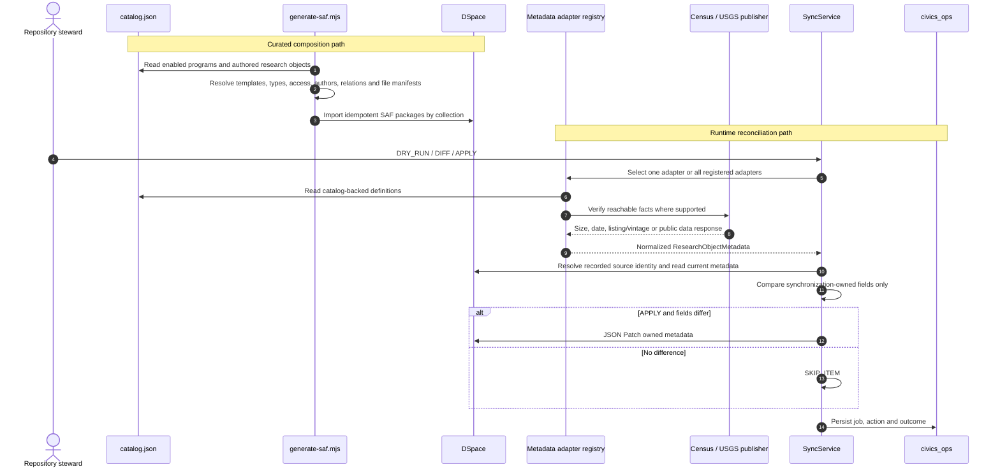
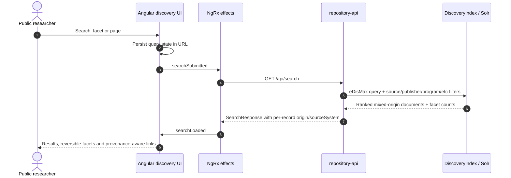
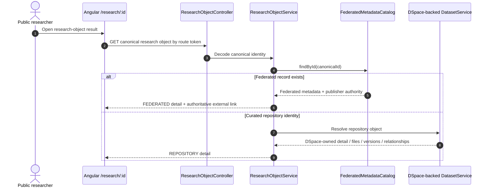
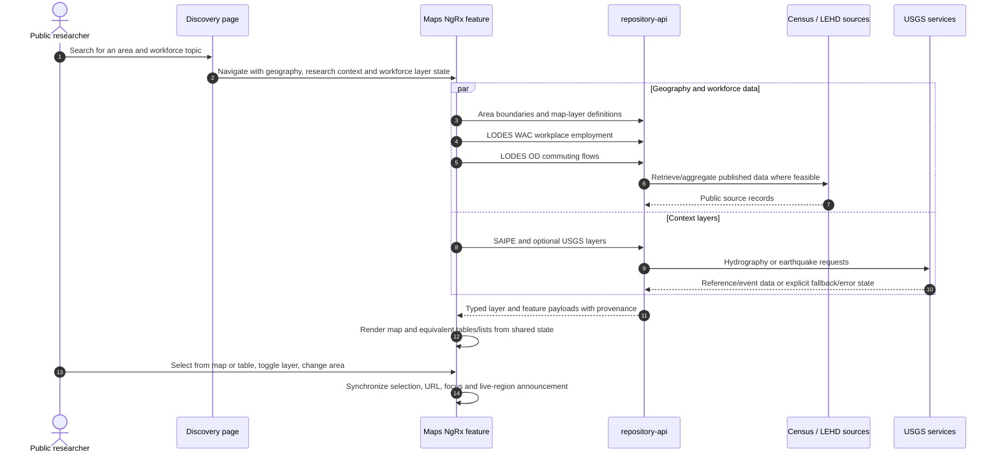
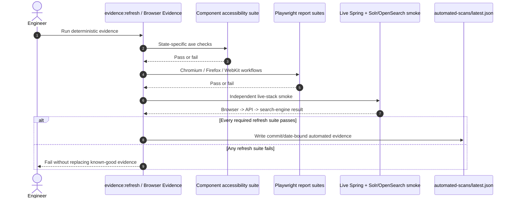

# Architecture Diagrams

These diagrams describe the current implementation. Planned work is not drawn as if it exists; open seams are listed at the end. Curated volatile counts are generated in [platform-status.md](platform-status.md), while live federation-scale facts are recorded in [PI-1 Data.gov Scale Evidence](../planning/PI1_DATA_GOV_SCALE_EVIDENCE.md).

## C4 Level 1 — System context



The local demo is unauthenticated. Before deployment, steward actions require an authorization boundary; public discovery remains anonymous.

## C4 Level 2 — Containers



## Authority model



Search indexes are never authoritative. Federated records do not become DSpace items merely because they are searchable.

## Curated repository composition and reconciliation



The curated composition path remains separate from federated metadata harvesting. Publisher facts can be discovered; repository composition and typed research-package relationships remain curated.

## Federated harvest and scale-evidence path

```mermaid
sequenceDiagram
    autonumber
    actor steward as Operator
    participant api as Federation admin API
    participant run as FederatedHarvestRunService
    participant source as Data.gov
    participant ops as Application PostgreSQL
    participant snapshot as BoundedSnapshot service
    participant projection as DiscoveryProjectionService
    participant solr as Solr
    participant os as OpenSearch

    steward->>api: POST bounded harvest(pageSize, maxPages)
    api->>run: start or resume compatible durable run
    loop bounded pages
        run->>source: Fetch page using opaque cursor
        source-->>run: Publisher metadata + next cursor
        run->>ops: Persist normalized records + checkpoint + counters
    end
    run->>ops: Persist PAUSED/COMPLETED run state

    steward->>snapshot: Capture deterministic bounded snapshot
    snapshot->>ops: Persist snapshot identity + counters + cursor/window

    steward->>projection: Guarded snapshot -> projection
    projection->>ops: Capture checkpoint before projection
    projection->>projection: Stream CombinedDiscoveryCatalog pages + SHA-256 digest
    projection->>solr: Bounded normalized batches
    projection->>os: Same normalized batches
    projection->>ops: Re-read checkpoint after projection
    alt checkpoint unchanged
        projection->>ops: Persist snapshot/projection relationship
    else checkpoint drifted
        projection-->>steward: Reject linkage; do not claim evidence
    end
```

A bounded `PAUSED` run is expected when the operator limit is reached. Ordinary harvest calls resume the same compatible run/cursor; restart-from-beginning is deliberately separate.

## Mixed-origin search and faceted discovery



The source/publisher/program facets are response-driven. Federated publisher program values do not require a Java enum or fixed Angular allowlist.

If neither DSpace nor the federated metadata catalog has authoritative content, fixture content may be used only with explicit fixture provenance.

## Authority-neutral research-object detail



`/datasets/:id` remains a compatibility UI route. Federated detail does not invent local versions, map layers or file preservation.

## Discovery to workforce map



## Accessibility and browser evidence



Manual keyboard, NVDA, JAWS, map-equivalence and cognitive records remain outside this automated sequence.

## Current seams

- Data.gov 10K harvest/resume is proven; 10K snapshot/projection/search/storage/resource evidence is still being closed before 100K.
- DOE OSTI, NASA CMR, PubMed and OpenAlex adapters remain PI-1 work.
- DOI/PMID/other durable-identifier reconciliation remains open; title-based silent merging is forbidden.
- Public discovery still uses offset paging; opaque cursor/search-after migration remains open for million-record scale.
- Live Data.gov program values can be opaque codes such as `010:10`; presentation hardening must preserve raw source semantics and avoid fixed UI allowlists.
- Projection-level compatibility `REPOSITORY` can represent a mixed authority-backed corpus; per-record `origin` and `sourceSystem` are correct, but the aggregate label may be clarified later.
- Bitstream mirroring remains bounded by budget rather than complete.
- Manual assistive-technology and trusted map-click evidence is not yet fully recorded.
- Browser evidence exists; required-check/branch-protection governance remains open.
- AWS architecture is documented but is intentionally deferred until PI-2 local Kubernetes evidence informs the implementation candidate.
