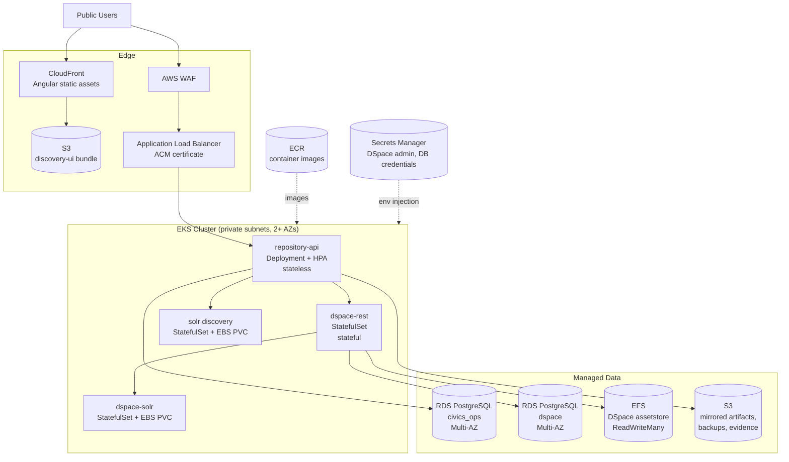

# AWS Modernization Direction

A credible container-first path from the local Docker demo to AWS, without requiring paid cloud deployment for the demo itself. Nothing here is deployed; this documents the target and the reasoning, which is the artifact a modernization conversation actually needs.

## Position

The local Docker Compose stack is the deliverable. This document exists so the demo can answer "what would it take to run this for real" with specifics rather than a shrug — and so the answer shows awareness of the parts that are genuinely hard (Solr persistence, DSpace assetstore, migration sequencing) instead of only the easy parts.

## Docker-First Local Architecture

Everything runs from one Compose file with named volumes for state:

| Service           | Image                                  | Local port | Persistent volume            |
| ----------------- | -------------------------------------- | ---------- | ---------------------------- |
| `discovery-ui`    | node:24 running the Angular dev server | 4200       | `node-modules`, `pnpm-store` |
| `repository-api`  | Locally built Java 21 image            | 8080       | `civics-artifacts`           |
| `postgres`        | postgres:17-alpine                     | 5432       | `postgres-data`              |
| `solr`            | solr:9, `discovery` core               | 8983       | `solr-data`                  |
| `dspace-rest`     | dspace/dspace:9.0                      | 8081       | `dspace-assetstore`          |
| `dspace-postgres` | dspace/dspace-postgres-pgcrypto:9.0    | 5433       | `dspace-postgres-data`       |
| `dspace-solr`     | dspace/dspace-solr:9.0                 | 8984       | `dspace-solr-data`           |

Properties worth preserving in any cloud target:

- State lives in volumes, so the demo survives a restart.
- DSpace sits behind a Compose profile, so the fast path does not pay DSpace startup cost.
- Configuration comes from environment variables, never compiled-in defaults.
- One quality gate (`quality:all`) covers format, contract, lint, unit, build, storyboard, and accessibility.

## Target: EKS / Kubernetes

**This is the recommended direction.** DSpace is a stateful, long-running Java application with an assetstore, a relational database, and its own Solr cores. Kubernetes handles that shape well, and it is the more common posture in federal programs with multi-year operational lifetimes and existing platform teams.

Mapping from Compose:

| Compose service                 | EKS workload                                                        | Why                                            |
| ------------------------------- | ------------------------------------------------------------------- | ---------------------------------------------- |
| `discovery-ui`                  | Not a workload — built in CI, published to S3, served by CloudFront | Static bundle; no reason to run a pod          |
| `repository-api`                | Deployment + HorizontalPodAutoscaler                                | Stateless; scales on request load              |
| `postgres`                      | RDS PostgreSQL (`civics_ops`)                                       | Managed backups, Multi-AZ, patching            |
| `dspace-postgres`               | RDS PostgreSQL (`dspace`)                                           | Same, kept as a separate instance or database  |
| `solr`                          | StatefulSet with EBS-backed PVC                                     | Rebuildable index, but needs stable storage    |
| `dspace-solr`                   | StatefulSet with EBS-backed PVC                                     | DSpace-owned cores                             |
| `dspace-rest`                   | StatefulSet with EFS-backed assetstore                              | Needs shared, durable file storage             |
| `dspace-seed`, `dspace-db-init` | Jobs / initContainers                                               | Run to completion before the app becomes ready |
| Sync CLI                        | CronJob                                                             | Scheduled harvest replaces manual `sync:apply` |

## Alternate: ECS / Fargate

Viable and cheaper to operate, listed as the alternate rather than the recommendation.

Reasonable fit for `repository-api`: stateless, horizontally scalable, no node management. Awkward fit for DSpace and Solr: Fargate task storage is ephemeral, so the assetstore requires EFS mounts and Solr requires EFS or a move to a managed search service. Neither is impossible; both fight the platform's ephemeral-by-design grain.

Choose ECS/Fargate when the operating team is small and wants no cluster to manage. Choose EKS when DSpace's statefulness, existing Kubernetes tooling, or portability across environments matters more than operational simplicity.

## RDS PostgreSQL

- Two logical databases: `civics_ops` (application sync state) and `dspace` (repository system of record). Separate instances give independent scaling, backup windows, and blast radius; a single instance with two databases is acceptable early and cheaper.
- Multi-AZ for the DSpace database. It is the system of record; losing it loses the repository.
- Automated backups with point-in-time recovery, and a documented restore rehearsal — an untested backup is not a backup.
- Credentials in Secrets Manager with rotation, injected as environment variables. This is the same discipline `.env` establishes locally.
- `gp3` storage with autoscaling enabled.

## Solr Persistence and Operational Tradeoffs

The genuinely awkward part of this architecture, and worth naming directly.

The `discovery` core is a **projection**: it can be rebuilt from DSpace, so it is recoverable rather than precious. DSpace's own cores are closer to operational state — rebuildable via `dspace index-discovery -b`, but slow enough at scale that it is not a casual operation.

Options, in order of preference:

1. **Solr on EKS with EBS-backed StatefulSets.** Keeps parity with local development and DSpace's supported configuration. Operational cost: patching, capacity, and reindex runbooks are yours.
2. **Amazon OpenSearch Service for the discovery projection only**, keeping DSpace's Solr cores self-managed. Removes the burden from the public-facing search path while staying within DSpace's supported setup. Cost: the query and facet layer in `SolrSearchClient` must be rewritten, and DSpace still needs Solr, so this reduces rather than removes the problem.
3. **Managed Solr through a third party.** Rarely justified for this workload.

Whichever is chosen, the reindex path must be a documented, rehearsed operation with a known duration, not an emergency improvisation. Discovery being briefly stale is survivable; discovery being wrong is not.

## CloudFront and Static Frontend

- Build the Angular bundle in CI, publish to a private S3 bucket, serve through CloudFront with Origin Access Control.
- Route `/api/*` to the ALB so the browser sees a single origin. This also removes the CORS configuration that exists only for local development.
- Long cache lifetimes on hashed assets (`outputHashing: all` is already configured), no-cache on `index.html`.
- WAF in front for rate limiting and common rule sets.
- Security headers via CloudFront response headers policy: HSTS, `X-Content-Type-Options`, a CSP tightened to the map tile and USGS origins the app actually uses.

## Logging, Monitoring, and Backup

**Logging.** Container stdout to CloudWatch Logs via Fluent Bit. Structured JSON from Spring Boot with a correlation ID per request. Retain application logs 30 days hot, archive to S3 with lifecycle rules for longer retention.

**Metrics and health.** The API already exposes `/api/health`; add Actuator liveness and readiness probes distinctly — readiness must fail while a sync job holds the context, liveness must not. Watch: API latency and error rate, Solr query latency, DSpace REST availability, sync job success rate and duration, RDS connections and storage, EFS throughput.

**Tracing.** OpenTelemetry to X-Ray. The sync path crosses API, DSpace, and two databases; a trace is worth more than four log searches.

**Alerting.** Alarm on sustained 5xx rate, sync job failures, RDS storage and connection thresholds, and certificate expiry. Route to whatever the program already uses rather than inventing a channel.

**Backup.** RDS automated backups plus point-in-time recovery. EFS backups via AWS Backup for the assetstore. S3 versioning on mirrored artifacts. Solr is deliberately excluded — it is rebuilt, not restored. Document and rehearse the recovery order: RDS first, then assetstore, then reindex Solr, then verify with `dspace:verify:seed`.

## Cost Posture

Not deployed, so these are shape rather than figures. Largest line items in order: EKS control plane and nodes, two Multi-AZ RDS instances, EFS throughput, then NAT Gateway data processing. Meaningful reductions available: a single RDS instance with two databases, single-AZ for non-production, Graviton node types, and scaling non-production environments to zero outside working hours.

## What This Demo Deliberately Does Not Do

Stated plainly so the gap is a choice rather than an oversight:

- No infrastructure-as-code. Terraform or CDK for the above is the natural next artifact.
- No authentication or authorization. See [planning/DECISIONS.md](../planning/DECISIONS.md) under "Admin API Authentication".
- No CI/CD pipeline. `quality:all` is the gate and runs locally; wiring it to a pipeline is deferred deliberately, not forgotten.
- No multi-tenancy, no FedRAMP or ATO control mapping, no disaster-recovery RTO/RPO targets. Each is a real program conversation this demo is not trying to simulate.

## Migration Sequence

If this were to become real, in dependency order:

1. Infrastructure-as-code for VPC, RDS, EKS, ECR, S3, CloudFront.
2. CI pipeline running `quality:all`, publishing images to ECR and the UI bundle to S3.
3. Stand up RDS and restore or migrate the DSpace database; validate with DSpace's own migration tooling.
4. Deploy DSpace as a StatefulSet with the EFS assetstore; verify REST reachability and reindex.
5. Deploy `repository-api`; point it at RDS, Solr, and DSpace through Secrets Manager configuration.
6. Publish the UI to S3/CloudFront; route `/api/*` to the ALB.
7. Convert sync to a CronJob; add authentication to the admin routes **before** this step, not after.
8. Add observability, alerting, and rehearsed backup restore.
