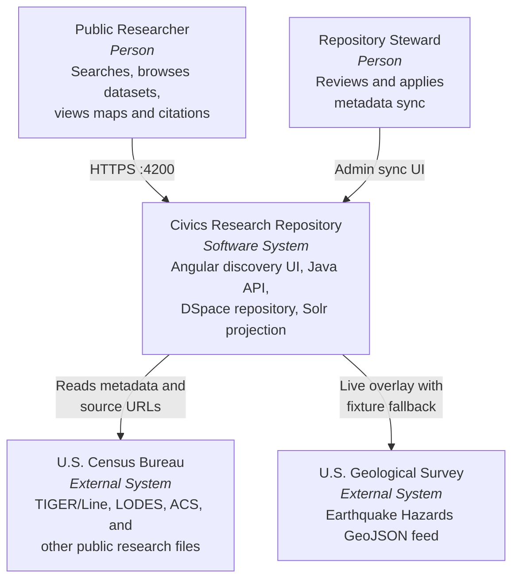
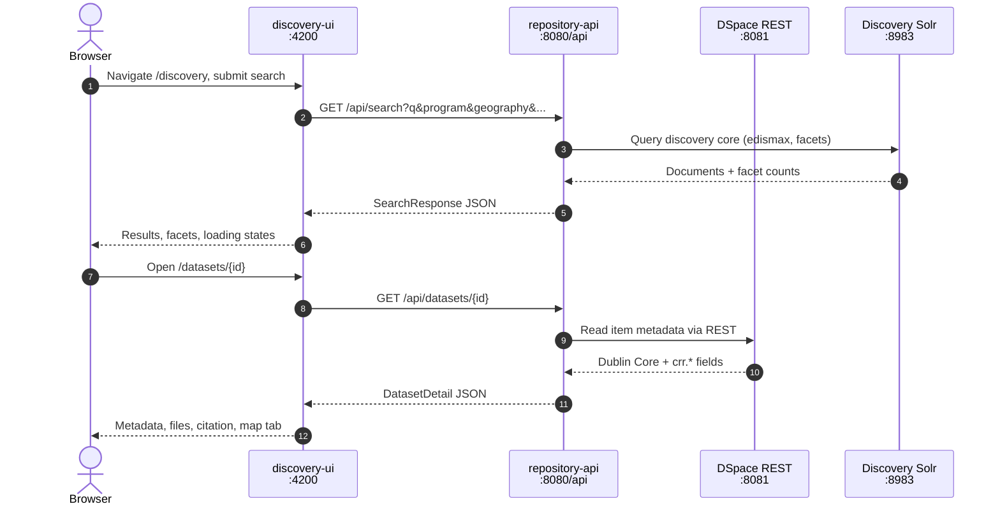

# Architecture Walkthrough

Narrative tour of the Civics Research Repository demo stack for interview Q&A. For decision rationale and honest limits, see [tradeoffs.md](tradeoffs.md). For C4 diagrams and sequence charts, see [architecture-diagrams.md](../architecture-diagrams.md).

## System context

Both people are roles, not accounts. The local demo is unauthenticated; admin sync endpoints have no authn in Docker.

## Request flow

The browser never calls DSpace, Solr, or USGS directly. Every integration is owned by the Java API.

Types on both sides are generated from the OpenAPI contract in `schemas/openapi/repository-api.yaml`.

## Two PostgreSQL and two Solr

Four datastores across two systems. Each has one job:

| Service           | Port | Database / core | Role                           | Owner            |
| ----------------- | ---- | --------------- | ------------------------------ | ---------------- |
| `postgres`        | 5432 | `civics_ops`    | Sync job history (`sync_jobs`) | `repository-api` |
| `dspace-postgres` | 5433 | `dspace`        | Repository system of record    | DSpace           |
| `solr`            | 8983 | `discovery`     | Public discovery projection    | `repository-api` |
| `dspace-solr`     | 8984 | DSpace cores    | DSpace internal search and OAI | DSpace           |

The application database was renamed from `dspace` to `civics_ops` so the split is legible from the connection string alone. Discovery Solr is **not** the source of truth—it is rebuilt from DSpace by `DiscoveryProjectionService` on every reindex.

## Seed vs sync vs projection

Three distinct operations often conflated in conversation:

| Operation      | What it does                                                                                               | When it runs                    | Entry point                                   |
| -------------- | ---------------------------------------------------------------------------------------------------------- | ------------------------------- | --------------------------------------------- |
| **Seed**       | Imports SAF packages from `tools/dspace/catalog.json` into DSpace (181 items, 14 programs, 52 geographies) | First run or after volume reset | `pnpm run start:all` → `dspace-seed`          |
| **Sync**       | Reconciles live publisher metadata against DSpace items (TIGER/Line adapter today)                         | API startup and admin UI        | `StartupSyncRunner`, `/admin/sync`            |
| **Projection** | Rebuilds the `discovery` Solr core from current DSpace items                                               | After seed, sync, or on demand  | `POST /api/admin/reindex`, `pnpm run reindex` |

**Seed** establishes breadth in the repository. **Sync** keeps selected items current against census.gov. **Projection** makes repository content searchable—the UI reads Solr through the API, not DSpace directly.

See [ingestion-walkthrough.md](ingestion-walkthrough.md) for the full catalog → SAF → seed → sync → reindex pipeline.

## Docker service map

`pnpm run start:all` and `pnpm run demo:up` share the same flow via [tools/scripts/compose-stack.mjs](../../tools/scripts/compose-stack.mjs):

1. Start DSpace profile (`dspace-postgres`, `dspace-solr`, `dspace-rest`).
2. Generate SAF packages when the catalog stamp changes.
3. Run `dspace-seed` (one-shot import).
4. Start application stack (`postgres`, `solr`, `repository-api`, `discovery-ui`).
5. Wait for API health, reindex discovery, wait for UI.

| Service         | Host port | Purpose                       |
| --------------- | --------- | ----------------------------- |
| discovery-ui    | 4200      | Angular public UI             |
| repository-api  | 8080      | Java REST API (`/api`)        |
| dspace-rest     | 8081      | DSpace 9 REST (`/server/api`) |
| postgres        | 5432      | Application PostgreSQL        |
| dspace-postgres | 5433      | DSpace PostgreSQL             |
| solr            | 8983      | Discovery Solr                |
| dspace-solr     | 8984      | DSpace Solr                   |

Startup prints five demo URLs in order. Stop with `pnpm run demo:down`. Full reset: `pnpm run docker:reset:everything`.

## Fixture fallback

When DSpace is empty, unreachable, or returns no items, the API indexes and serves a **generated fixture catalog** instead of failing the demo:

1. `generate-saf.mjs` emits `apps/repository-api/src/main/resources/discovery-fixture-catalog.json` alongside SAF packages.
2. `DiscoveryProjectionService` indexes fixture data when the repository yields nothing.
3. Every API response carries `resultSource: FIXTURE` (or `source: FIXTURE` on detail).
4. The UI shows a placeholder-data notice so fallback is never presented as repository truth.

Reindex after restoring DSpace to switch back to `resultSource: REPOSITORY`. If startup warns about FIXTURE data, run `pnpm run dspace:verify:seed`.

USGS overlays follow the same pattern at a smaller scale: live GeoJSON when the feed responds, bundled fixture with `fallback: true` when it does not.

## What to say in an interview

- **System of record:** DSpace holds communities, collections, items, and metadata. Solr is a rebuildable projection.
- **Single API surface:** The Angular UI talks only to `repository-api`; credentials and integration complexity stay server-side.
- **Breadth vs live sync:** 164 seeded objects prove paging and facets; startup sync reconciles TIGER/Line North Dakota today.
- **Honest fallback:** Fixture data keeps CI and disaster demos running, with explicit disclosure in the contract and UI.

For Q&A on specific decisions—bounded bitstream mirroring, unauthenticated admin routes, Java vs Node harvest boundaries—see [tradeoffs.md](tradeoffs.md).
