# Dataset Ingestion Walkthrough

How public Census and USGS metadata enters the Civics Research Repository demo—from curated catalog tables through DSpace seed, startup sync, and Solr reindex.

## Overview

```mermaid
flowchart LR
  pub["Publisher hosts<br/>census.gov, usgs.gov"]
  cat["tools/dspace/catalog.json"]
  saf["generate-saf.mjs<br/>SAF packages"]
  seed["dspace-seed<br/>DSpace import"]
  ds["DSpace REST<br/>system of record"]
  sync["repository-api sync<br/>adapters + apply"]
  proj["DiscoveryProjectionService<br/>reindex"]
  solr["Discovery Solr<br/>discovery core"]
  ui["Angular discovery UI"]

  pub -->|"harvest-catalog.mjs<br/>verify + vintage hints"| cat
  cat --> saf --> seed --> ds
  ds --> sync --> ds
  ds --> proj --> solr --> ui
  sync --> proj
```



The committed source of truth for **breadth** (which programs, geographies, and vintages to seed) is `tools/dspace/catalog.json`. Generated SAF packages under `tools/dspace/saf/` are build output and git-ignored.

## Step 1 — Catalog table

`tools/dspace/catalog.json` defines:

- **areas:** fifty-two state and territory geographies with FIPS codes.
- **programs:** fourteen enabled publisher programs (TIGER/Line, LODES, ACS PUMS, CPS, SIPP, USGS overlays, and eight additional Census programs).
- **Templates:** URL patterns, titles, citations, and file manifests parameterized by area and vintage.

Changing breadth means editing the table—disabling a program, trimming areas, or updating a vintage year—not adding hundreds of hand-written XML directories.

See [data-storage-sync.md](../data-storage-sync.md) for the file manifest and no-large-mirror policy.

## Step 2 — SAF generation

```bash
pnpm run dspace:saf:generate
# or as part of seed:
pnpm run dspace:seed
```

`tools/scripts/generate-saf.mjs` expands the catalog into DSpace Simple Archive Format packages:

1. For each enabled program, fill URL and title templates per area (or once for national scope).
2. Skip program/area combinations listed in `unavailableAreas` (for example LODES WAC where LEHD does not publish).
3. Write `dublin_core.xml`, `metadata_crr.xml`, and `contents` per item, named by **source identifier** so seed resume stays stable when the mix changes.
4. Emit `apps/repository-api/src/main/resources/discovery-fixture-catalog.json`—the labelled API fallback when DSpace is unreachable.

## Step 3 — DSpace seed

```bash
pnpm run dspace:seed
```

Docker Compose runs `dspace-seed`, which imports SAF packages into DSpace PostgreSQL and indexes DSpace-internal Solr cores. The seed is self-healing when its mapfile outlives the database volume.

Verify:

```bash
pnpm run dspace:verify:seed
pnpm run dspace:verify
```

## Step 4 — Startup sync (TIGER adapter)

On API startup, `StartupSyncRunner` reconciles live publisher metadata against DSpace for configured sources. The first adapter is **TIGER/Line** for the North Dakota visual slice:

- Reads file size and `Last-Modified` from the publisher URL when census.gov responds.
- Normalizes title, program, geography, vintage, file manifest (`crr.file.manifest`), and citation.
- Applies through the same diff/apply path as the admin UI.

Sync modes:

| Mode    | Purpose                                |
| ------- | -------------------------------------- |
| DRY_RUN | Plan actions without writing           |
| DIFF    | Compare source vs DSpace; report drift |
| APPLY   | Upsert items and manifests in DSpace   |

CLI and API entry points are documented in [docker-dspace-solr-postgres.md](../docker-dspace-solr-postgres.md).

## Step 5 — Discovery projection / reindex

DSpace is the system of record; the **`discovery` Solr core is a rebuildable projection**.

```bash
pnpm run reindex
pnpm run reindex:status
```

`DiscoveryProjectionService`:

1. Invalidates the in-memory repository catalog cache.
2. Reads all research objects from DSpace REST.
3. Indexes them into discovery Solr (or serves fixture catalog if the repository is empty).
4. Records `resultSource: REPOSITORY` or `FIXTURE` for API responses.

Anything that exists only in Solr is a bug. See [architecture.md](../architecture.md).

## Catalog harvesting

Hand-curated breadth in `catalog.json` is the interim model; `verify:sources` guards URL validity. Auto-discovery reduces manual vintage updates:

```bash
pnpm run catalog:harvest              # report: broken URLs, vintage hints
pnpm run catalog:harvest -- --write   # apply verified vintage bumps to catalog.json
pnpm run verify:sources               # fast sample check after catalog changes
pnpm run verify:sources:all           # every URL in every SAF package
```

`tools/scripts/harvest-catalog.mjs`:

- Expands the catalog the same way SAF generation does.
- Probes publisher URLs (HEAD with GET fallback).
- Suggests newer vintages where directory patterns or sample files resolve.
- Optionally writes vintage updates back to `catalog.json`; always regenerate SAF after a write.

Harvest coverage starts with programs already in the catalog (ACS PUMS, TIGER, LODES, CPS, SIPP, USGS overlays). Additional discoverers can be registered without changing the pipeline shape.

## Operational checklist after a catalog change

1. `pnpm run catalog:harvest` — review report.
2. Edit `catalog.json` or run `catalog:harvest --write` if vintage bumps look correct.
3. `pnpm run dspace:saf:generate && pnpm run dspace:seed`
4. `pnpm run reindex`
5. `pnpm run verify:sources` — confirm publisher links still resolve.
