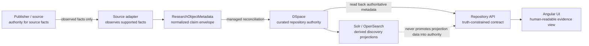

# Provenance, Authority, and Evidence

The Civics Research Repository treats provenance as an architectural contract rather than a decorative metadata field.

The central question is not merely **"where did this value come from?"** It is:

> **Who is authoritative for this claim, what was actually observed, what evidence supports it, where is that evidence persisted, and what is the application allowed to conclude from it?**

This document defines that model for curated repository objects, federated metadata, derived search projections, version history, and the evidence shown in the web application.

## Why this matters

Federal research systems routinely combine facts from publishers, repository records, indexes, transformations, caches, and analytical products. Without a clear authority model, a derived value can quietly become indistinguishable from an authoritative one.

That creates several failure modes:

- a search index is mistaken for the system of record;
- an inferred year becomes a fabricated release;
- a current URL is treated as proof of historical lineage;
- a synchronization timestamp is mislabeled as a source capture timestamp;
- a missing checksum is represented as though fixity were verified;
- federated metadata is treated as though the local repository owns the underlying research object;
- generated UI text makes a stronger claim than the stored evidence supports.

The repository therefore follows a simple rule:

> **Evidence may strengthen a claim, but missing evidence must never be replaced by inference merely to make the record look complete.**

## The four-part model

Every provenance-sensitive fact is evaluated across four distinct concepts.

### 1. Authority

**Authority** answers: _Which system or publisher is entitled to assert this fact?_ 

Examples:

- DSpace is authoritative for curated repository metadata after that metadata has been reconciled into the managed repository record.
- An external publisher remains authoritative for a federated research object and its downloadable resources.
- The application PostgreSQL database is authoritative for application-owned operational evidence such as harvest checkpoints and sync-job outcomes.
- Solr and OpenSearch are never authoritative. They are rebuildable discovery projections.

Authority is contextual. One system does not become authoritative for every field merely because it stores a copy.

### 2. Observation

**Observation** answers: _What did the system actually see?_ 

Examples include:

- an explicit source version such as `TIGER2025`;
- a publisher `Last-Modified` value;
- source bytes that were actually retained and hashed;
- a DOI supplied by the publisher or repository record;
- an earlier repository version that was independently observed.

Observation is intentionally narrower than inference. A vintage year, URL path, file name, or current clock time may help explain a record but does not automatically become provenance evidence.

### 3. Evidence

**Evidence** answers: _What durable material supports the observation?_ 

Evidence can include:

- persisted DSpace metadata;
- source URLs;
- source-provided version identifiers;
- SHA-256 digests computed from retained bytes;
- capture timestamps tied to actual retrieval;
- DOI/ORCID identifiers;
- synchronization job records;
- deterministic replay results;
- bounded harvest checkpoints and snapshot digests;
- browser/API evidence that reads the same persisted fact back through the public contract.

Evidence strength is not binary. A source label proves something different from a checksum, and a checksum proves something different from version lineage.

### 4. Claim

**Claim** answers: _What may the API and UI truthfully say?_ 

Claims must be no stronger than the combined authority and evidence permit.

For example:

- `OBSERVED_CURRENT_ONLY` means the current record is observed but broader history is unknown.
- `HISTORY_AVAILABLE` is valid only after distinct versions and their lineage have actually been observed.
- a displayed SHA-256 means the digest exists as evidence; no digest means fixity is not established.
- a displayed capture time means an actual observation was retained at that time; the sync execution clock cannot substitute for it.

## Authority matrix

| Information | Primary authority | Persisted copy / evidence | Derived consumers | What must not happen |
| --- | --- | --- | --- | --- |
| Curated research-object metadata | DSpace repository record after managed reconciliation | DSpace PostgreSQL / REST metadata | API, Angular UI, Solr, OpenSearch | Search indexes must not become the source of truth |
| Federated research-object metadata | External publisher/catalog | Application PostgreSQL bounded harvest record and checkpoints | Combined discovery, API, UI, indexes | Local storage must not imply ownership of publisher content |
| Sync outcomes | Repository synchronization service | Application PostgreSQL sync jobs/actions | Steward UI, CI evidence | A successful HTTP response must not replace recorded reconciliation state |
| Search ranking/facets | No independent domain authority; they are derived behavior | Solr/OpenSearch projection plus deterministic fixtures/evidence | Discovery UI | Ranking output must not overwrite repository metadata |
| Version label/date | Source or repository evidence | Managed DSpace version fields | Version API/UI | Vintage or naming conventions must not fabricate history |
| SHA-256 fixity | Retained bytes or authoritative supplied digest | Managed provenance metadata / evidence artifact | Version API/UI | URL/file size must not masquerade as a digest |
| Capture time | Actual retained observation | Managed provenance metadata / evidence artifact | Version API/UI | Current sync time must not be substituted |
| Version lineage | Observed repository/source relationship | Managed version relationship metadata | Version API/UI | Earlier/later versions must not be guessed |

## Authority flow



For federated research objects, the publisher remains authoritative and the application stores reproducible metadata/evidence without converting the record into a DSpace-owned research object merely because it is searchable.

## A claim-strength ladder

The UI should make the difference between levels visible rather than collapsing them into a generic "provenance available" badge.

### Level 0 — Authority identified

The system can identify who is authoritative for the research object or metadata record.

This does **not** establish version history, fixity, or capture evidence.

### Level 1 — Current observation established

The system has observed a current repository/source record and can identify the facts that were actually supplied.

This corresponds to `OBSERVED_CURRENT_ONLY` when no broader history has been established.

### Level 2 — Retained provenance evidence

The system has durable evidence such as a source version identifier, observation timestamp, DOI, source URL, or retained metadata record.

Each field is independent. Having a version label does not imply having fixity.

### Level 3 — Fixity established

A cryptographic digest such as SHA-256 is tied to retained source bytes or another authoritative digest source.

This supports a stronger statement: the retained bytes can be compared deterministically against the recorded digest.

### Level 4 — Lineage established

Distinct versions have been observed and their relationships are evidenced. Only here may production code claim `HISTORY_AVAILABLE`, `supersedes`, or a broader version timeline.

## The web application's evidence view

The Versions view is intentionally a **proof-oriented evidence surface**, not a generated timeline.

For each record it should expose, when available:

- authority context;
- version-history knowledge state;
- source version identifier;
- version/release date;
- source URL;
- DOI;
- actual capture timestamp;
- SHA-256 fixity;
- stable artifact identity (`isVersionOf`);
- supersession relationship;
- change note.

It should also expose negative knowledge explicitly. Examples:

- **Fixity not established** when no digest exists;
- **Capture not established** when no retained observation timestamp exists;
- **Earlier/later lineage not established** for `OBSERVED_CURRENT_ONLY`;
- **Publisher authoritative** for federated records;
- **Solr/OpenSearch are derived discovery projections, not authority**.

This is important because absence itself is part of the evidence model. A blank field is easy to misread as a rendering bug; an explicit "not established" statement tells the user exactly what the system can and cannot prove.

## Proof through replay

A provenance system is stronger when its claims can be regenerated and tested rather than inspected only as prose.

For curated provenance, the Phase B integration proof is:

1. start a real DSpace 9 stack;
2. seed the CRR metadata registry and curated structure;
3. APPLY observed source metadata;
4. read the DSpace-managed record;
5. DIFF the same source facts again;
6. require the reconciliation result to settle to `SKIP_ITEM` with no managed-field churn;
7. read `/research/{id}/versions` through the public API;
8. verify that supported provenance values are returned from persisted DSpace metadata;
9. verify unsupported facts such as SHA-256/capture time remain absent;
10. exercise the rendered Angular evidence view with Playwright and axe.

That chain tests much more than a mapper. It tests that a source observation can survive normalization, persistence, replay, API read-back, state management, rendering, and accessibility checks without becoming a stronger claim along the way.

## Machine-readable evidence

Human-readable UI is necessary, but it should not be the only representation of provenance.

The current typed API already provides the foundation for machine consumption. Future work should consider a deterministic evidence manifest that can be regenerated from authoritative state, for example:

```json
{
  "researchObjectId": "tiger-line-north-dakota-2025",
  "authority": {
    "kind": "REPOSITORY",
    "system": "DSpace"
  },
  "historyStatus": "OBSERVED_CURRENT_ONLY",
  "claims": [
    {
      "name": "sourceVersion",
      "value": "TIGER2025",
      "basis": "observed-source-metadata"
    },
    {
      "name": "sha256",
      "status": "NOT_ESTABLISHED"
    }
  ]
}
```

This example is a design direction, not a committed API contract. Issue #115 owns the broader structured metadata/export profile and should decide whether a formal evidence envelope belongs there.

## Relationship to FedRAMP 20x

There is a useful architectural analogy to the current direction of FedRAMP 20x, but the domains must remain separate.

FedRAMP 20x is a cloud-security authorization program. This repository's provenance model concerns research metadata, repository authority, reproducibility, fixity, lineage, and evidence. Implementing this model does **not** make the repository FedRAMP authorized, satisfy a FedRAMP control, or constitute a security assessment.

The useful shared pattern is **provable, reusable evidence instead of narrative-only trust**.

Current FedRAMP material emphasizes concepts such as:

- persistently validated posture and assessment materials;
- reusable information that supports ongoing agency decisions;
- machine-readable authorization data;
- evidence-backed validation;
- automated technical validation where possible;
- deterministic telemetry and regenerable machine-readable packages.

That pattern is directly useful here:

| FedRAMP-style engineering pattern | Research provenance analogue |
| --- | --- |
| Machine-readable authorization evidence | Typed provenance/version API and future evidence manifest |
| Persistent validation | Replay/idempotence checks against authoritative repository state |
| Automated technical validation | DSpace APPLY→DIFF proof, API read-back, browser assertions |
| Ongoing decision support | Researcher/steward can determine exactly what provenance is established |
| Evidence-backed assertion | UI/API claim strength cannot exceed persisted evidence |
| Reusable assessment material | Provenance facts can be consumed by UI, APIs, exports, and future automation |

Official references reviewed for this architectural comparison (September 2026):

- FedRAMP Authorization Designations / 20x Validated: <https://www.fedramp.gov/rfcs/0020/>
- FedRAMP 20x public availability / Consolidated Rules 2026 announcement: <https://www.fedramp.gov/2026-06-25-propelling-change-fedramp-launches-consolidated-rules-for-2026/>
- Phase One Key Security Indicators and evidence/automation principles: <https://www.fedramp.gov/rfcs/0006/>
- Collaborative Continuous Monitoring direction: <https://www.fedramp.gov/rfcs/0016/>
- Rev5 machine-readable package discussion (separate from 20x but relevant to the machine-readable evidence pattern): <https://www.fedramp.gov/rfcs/0024/>

Again: these are architectural references, **not compliance claims**.

## Testing obligations

A provenance feature is incomplete unless tests protect both the positive and negative claim boundaries.

Required test categories include:

- **unit/model tests** — optional evidence remains optional; no inference fills it;
- **mapper tests** — source facts map only to fields the source actually supports;
- **reconciliation tests** — APPLY followed by DIFF settles without churn;
- **repository integration** — real DSpace persists and reads back managed provenance fields;
- **API tests** — `OBSERVED_CURRENT_ONLY`, `HISTORY_AVAILABLE`, and `UNAVAILABLE` remain distinct;
- **negative tests** — vintage, file naming, timestamps, or fixtures cannot synthesize lineage/fixity;
- **Angular rendered tests** — explicit established/not-established evidence is understandable;
- **Storybook interaction + axe** — each provenance state is accessible in isolation;
- **Playwright Chromium/Firefox/WebKit + axe** — provenance evidence survives the real application route;
- **projection tests** — Solr/OpenSearch remain derived and disposable.

## Design rules

1. **Authority precedes storage.** Copying a fact into another database does not transfer authority.
2. **Observation precedes assertion.** Do not assert what was not observed.
3. **Evidence precedes stronger claims.** Fixity and lineage require their own evidence.
4. **Unknown is a valid state.** It is safer and more informative than fabricated completeness.
5. **Derived indexes stay derived.** Search engines improve discovery; they do not establish truth.
6. **Replay is evidence.** Idempotent reconciliation demonstrates that persisted authority and source observations agree.
7. **Human-readable and machine-readable views should agree.** The UI must not say more than the API contract can support.
8. **Negative evidence deserves tests.** "Not established" behavior must be protected from future convenience shortcuts.
9. **Accessibility is part of evidence delivery.** A provenance claim that cannot be reached or understood by assistive technology is not fully usable evidence.
10. **Compliance analogies must remain explicit analogies.** Borrow evidence engineering patterns without implying certifications the system does not possess.

## Phase A / B / C relationship

The #114 work deliberately builds this model in increasing claim strength:

- **Phase A — truthful knowledge states.** Remove synthetic history and represent current-only, available history, and unavailable provenance explicitly.
- **Phase B — authoritative current provenance.** Persist observed facts through DSpace, read them back through the API, expose them in the UI, and prove replay/idempotence.
- **Phase C — observed multi-version lineage.** Promote to `HISTORY_AVAILABLE` only when distinct versions and their relationships are genuinely evidenced.

This sequencing is deliberate: the repository earns stronger claims by adding stronger evidence rather than by adding more confident wording.